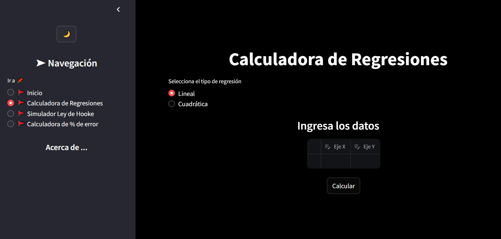
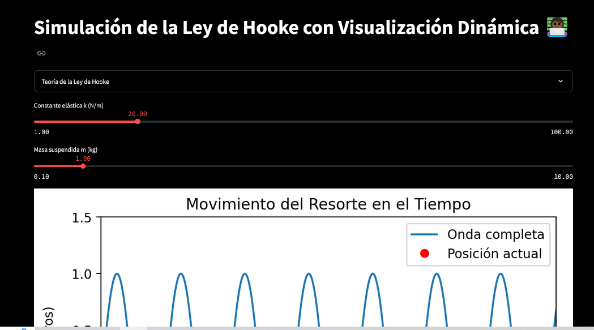
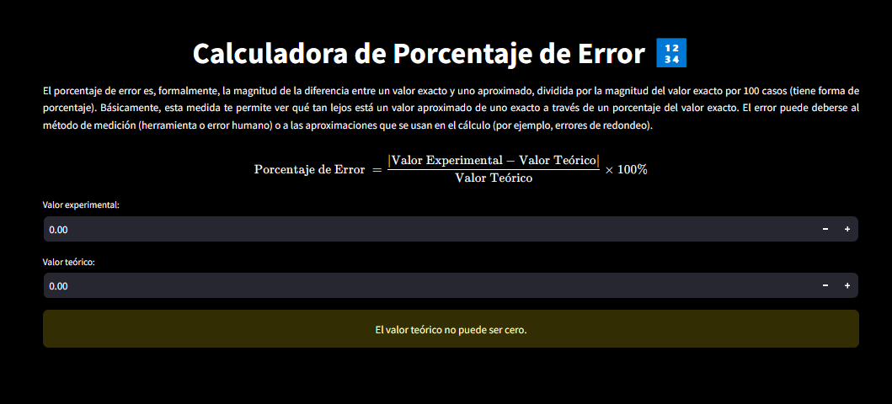
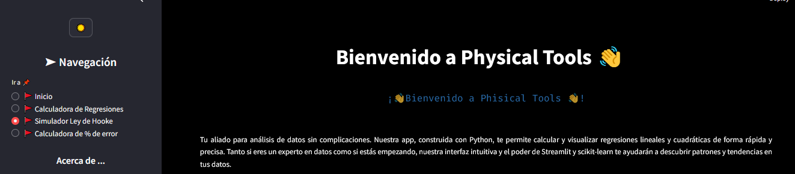

# Physical Tools 🔬

**Tu aliado para análisis de datos sin complicaciones.**


Physical Tools es una aplicación web interactiva diseñada para facilitar el análisis de datos y la exploración de conceptos físicos clave. Nuestra plataforma ofrece herramientas intuitivas y visualizaciones atractivas para ayudarte a comprender y aplicar principios científicos en tus proyectos e investigaciones.

## Características Principales 🚀

* **Calculadora de Regresiones:** Realiza análisis de regresión lineal y polinomial con facilidad. Visualiza tus datos y encuentra las mejores curvas de ajuste.

* **Simulador de Ley de Hooke:** Experimenta con la Ley de Hooke a través de simulaciones interactivas. Ajusta parámetros y observa cómo cambia el comportamiento de resortes y sistemas elásticos.

* **Calculadora de Porcentaje de Error:** Evalúa la precisión de tus mediciones experimentales comparándolas con valores teóricos.

* **Interfaz Amigable:** Navega fácilmente por nuestras herramientas gracias a una interfaz intuitiva y organizada.


* **Temas Personalizables:** Elige entre temas claro y oscuro para adaptar la apariencia de la aplicación a tus preferencias.

## Cómo Empezar 🏁

1. **Clona el Repositorio:**
   ```sh
    git clone https://github.com/JonathanArroyaveGonzalez/Physical_tools.git
   ```
   
